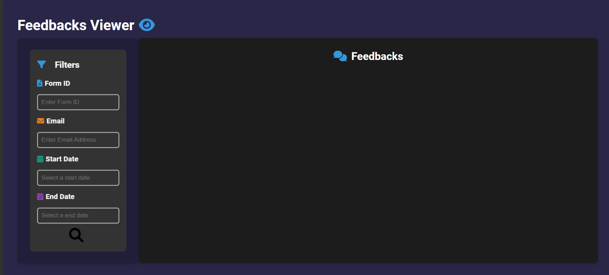

# Form Builder API


## Overview
The **Form Builder API** is a powerful tool designed for creating dynamic, customizable forms with advanced features for both web and mobile platforms. It integrates seamlessly with **Express.js**, **MongoDB**, **GROQ**, and **Llama** for a robust backend, while **Pug**, **Sortable.js**, **Chart.js**, and **jQuery** power the frontend. It provides developers with the ability to:

- Generate intelligent forms with AI using Llama.
- Store, retrieve, and update forms in MongoDB.
- Visualize feedback analytics using charts.
- Seamlessly integrate with an Android SDK to render forms on mobile devices.

## Key Features

### 🔥 AI-Driven Form Generation
- Generate modular forms with a single API call.
- AI ensures questions are thoughtful, relevant, and visually appealing.
- Automatic validation of generated components for consistency and usability.

### 🚀 Seamless Frontend Integration
- **Pug** templates ensure fast rendering and responsiveness.
- Drag-and-drop functionality using **Sortable.js**.
- Intuitive visualizations powered by **Chart.js**.
- Dynamic interactivity enhanced by **jQuery**.

### 📱 Mobile SDK Integration
- Forms generated by the API return an ID.
- This ID can be used in your Android application to load forms dynamically.
- Provides real-time feedback submission from mobile devices.

### 🛠️ Modular Components
- Supports a variety of components:
    - **Textbox**
    - **Combobox**
    - **5-Star Rating**
    - **Scale Bar**
    - **Titles**

### 📊 Feedback Analytics
- Analyze form responses visually with pie charts and bar charts.
- Export analytics data for further processing.

---

## Quick Start

### 1️⃣ Prerequisites

Ensure you have the following installed:
- **Node.js** v14+
- **MongoDB** v4+
- **npm** v6+
- **GROQ SDK** API Key

Install dependencies:
```bash
npm install
```

---

### 2️⃣ Environment Setup

Create a `.env` file in the root directory with the following variables:

```
GROQ_API_KEY=your_groq_api_key
MONGO_URI=mongodb://localhost:27017/form-builder
PORT=3000
```

---

### 3️⃣ Run the Application

Start the server:
```bash
npm start
```

Access the application at `http://localhost:3000`

---

## API Endpoints

### 📝 Form Management

#### **POST** `/api/forms/save`
Save a new form.

**Request Body:**
```json
{
  "name": "Customer Feedback Form",
  "theme": "light",
  "designData": {
    "backgroundColor": "#ffffff",
    "textColor": "#000000",
    "buttonBackgroundColor": "#3498db",
    "buttonTextColor": "#ffffff"
  },
  "components": [
    {
      "type": "textbox",
      "text": "What is your name?",
      "secondaryText": "Enter your full name.",
      "order": 1,
      "colors": {
        "backgroundColor": "#f9f9f9",
        "textColor": "#333333"
      }
    }
  ]
}
```

**Response:**
```json
{
  "success": true,
  "formId": "62df5b8451d9e80008a12345"
}
```

---

#### **GET** `/api/forms/:id`
Retrieve a form by its ID.

**Response:**
```json
{
  "_id": "62df5b8451d9e80008a12345",
  "name": "Customer Feedback Form",
  "theme": "light",
  "components": [ "..." ]
}
```

---

#### **PUT** `/api/forms/:id`
Update an existing form.

---

#### **DELETE** `/api/forms/:id`
Delete a form and its associated feedback.

---

### 🤖 AI-Driven Form Generation

#### **POST** `/api/forms/generate-form/:subject/:theme`
Generate a new form using AI.

**Request Parameters:**
- `subject`: The topic for the form.
- `theme`: Either `light`, `dark`, or `custom`.

**Response:**
```json
{
  "name": "Math Quiz",
  "theme": "dark",
  "components": [
    {
      "type": "title",
      "text": "Welcome to the Math Quiz",
      "order": 1
    },
    {
      "type": "textbox",
      "text": "What is 2 + 2?",
      "secondaryText": "Hint: It's greater than 3.",
      "order": 2
    }
  ]
}
```

---

### 📊 Feedback and Analytics

#### **POST** `/api/feedbacks`
Submit feedback for a form.

**Request Body:**
```json
{
  "formId": "62df5b8451d9e80008a12345",
  "email": "user@example.com",
  "responses": {
    "question1": {
      "answer": "John Doe",
      "type": "textbox",
      "order": 1
    }
  }
}
```

**Response:**
```json
{
  "message": "Feedback submitted successfully!",
  "feedback": { "Data" : "..."}
}
```

---

#### **GET** `/api/feedbacks`
Retrieve all feedback.

**Response:**
```json
[
  {
    "formId": "62df5b8451d9e80008a12345",
    "email": "user@example.com",
    "responses": { "Data" : "..." },
    "date": "2024-12-13T10:00:00Z"
  }
]
```

---

#### **GET** `/api/feedbacks/filter`
Filter feedback by form ID, email, or date range.

**Query Parameters:**
- `formId`: The form ID to filter by.
- `email`: The email address to filter by (case-insensitive).
- `startDate`: The start date for filtering.
- `endDate`: The end date for filtering.

**Response:**
```json
[
  {
    "formId": "62df5b8451d9e80008a12345",
    "email": "user@example.com",
    "responses": { "Data" : "..." },
    "date": "2024-12-13T10:00:00Z"
  }
]
```

---

#### **GET** `/api/feedbacks/analytics`
Retrieve aggregated analytics data for feedback responses.

**Query Parameters:**
- `formId`: The form ID to filter by.
- `startDate`: The start date for filtering.
- `endDate`: The end date for filtering.

**Response:**
```json
[
  {
    "question": "What is your name?",
    "stats": [
      { "answer": "John Doe", "count": 10 },
      { "answer": "Jane Doe", "count": 5 }
    ]
  }
]
```

---

## Frontend Pages

### 🏠 Home Page
The landing page for the application. Accessible at `/`.

### 🔨 Form Builder
Accessible at `/form-builder`, this page allows users to create new forms dynamically with drag-and-drop support and customizable styles.

### ✏️ Update Form
Accessible at `/update-form`, this page lets users edit existing forms by providing the form ID.

### 🗑️ Remove Form
Accessible at `/remove-form`, this page enables users to delete a form by its ID.

### 👁️ Feedback Viewer
Accessible at `/feedbacks-viewer`, this page displays all submitted feedback with filtering options based on form ID, email, and date.

### 📊 Analytics Viewer
Accessible at `/analytics-viewer`, this page provides visualizations of aggregated feedback data using pie charts and bar charts.

### ✅ Success Page
Accessible at `/success/:id`, this page validates a form ID and confirms its successful submission or updates.

---

## Deployment

1. Ensure MongoDB is running locally or use a cloud-based MongoDB service.
2. Deploy the API to a cloud platform like Heroku, AWS, or Azure.
3. Configure the `.env` file with production values.

---

## Contributing
We welcome contributions! Please follow these steps:
1. Fork the repository.
2. Create a new branch.
3. Commit your changes.
4. Submit a pull request.

---

## License
This project is licensed under the MIT License.
Copyright © 2024 Aviad Korakin. All rights reserved. Unauthorized reproduction or distribution is prohibited.

---


## Screenshots

### Form Builder UI


### Form Update

### Feedback Viewer

### Feedback Analytics


---

## Contact
For questions or feedback, please reach out to **[Aviad Korakin](mailto:aviad825@gmail.com)**.

